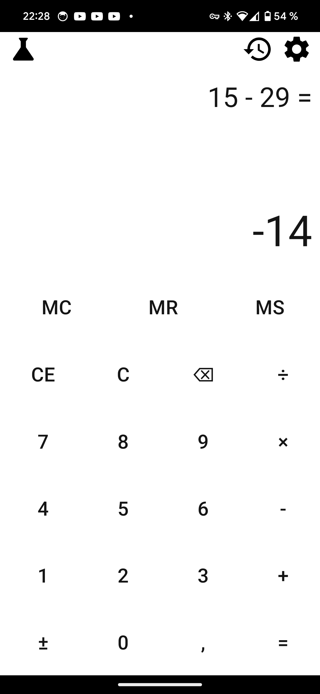
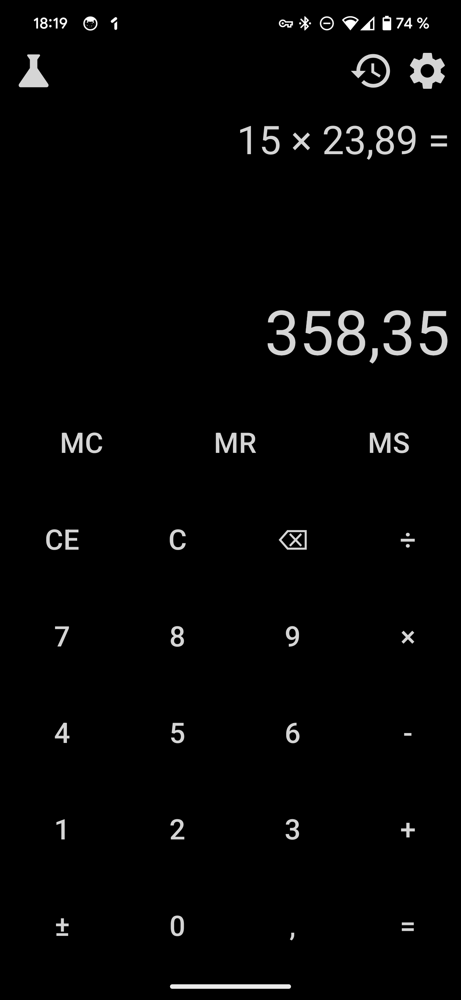
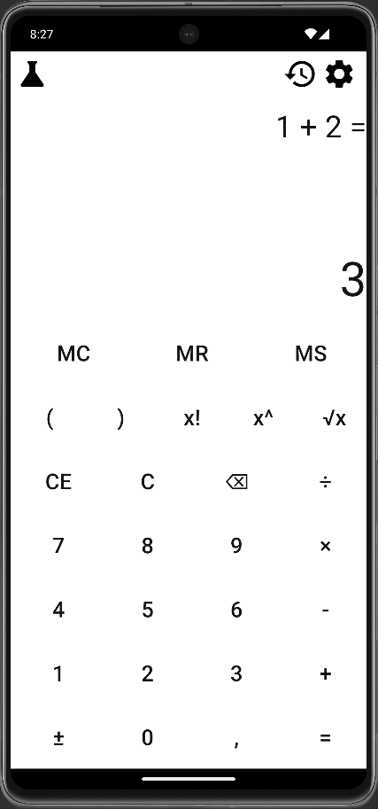
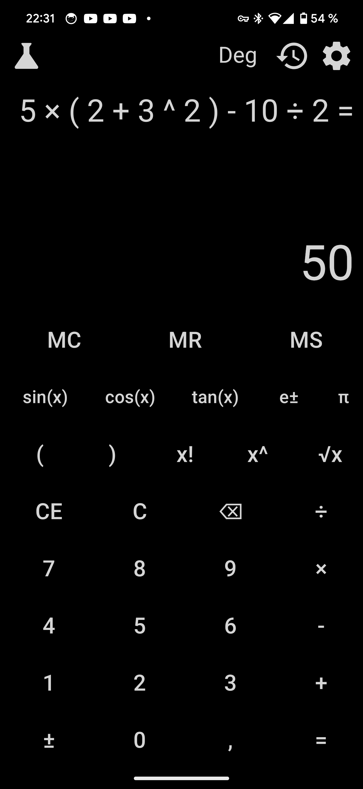
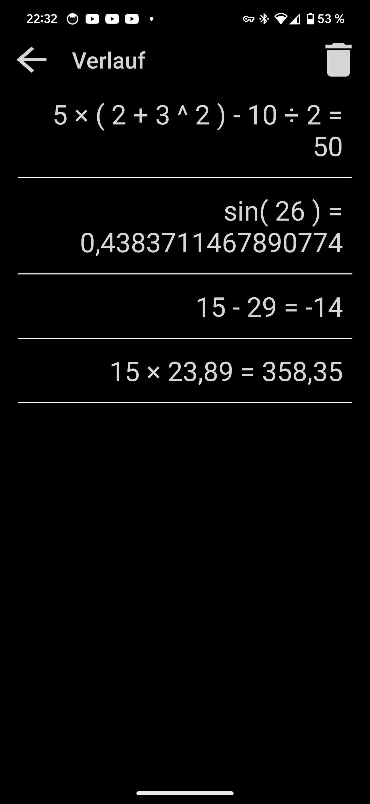
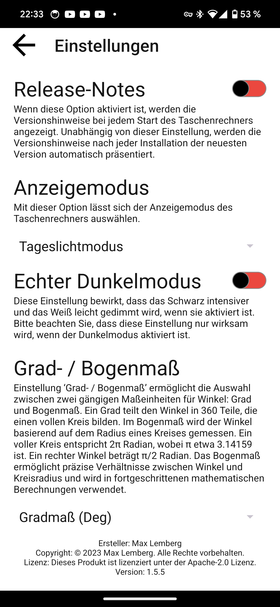
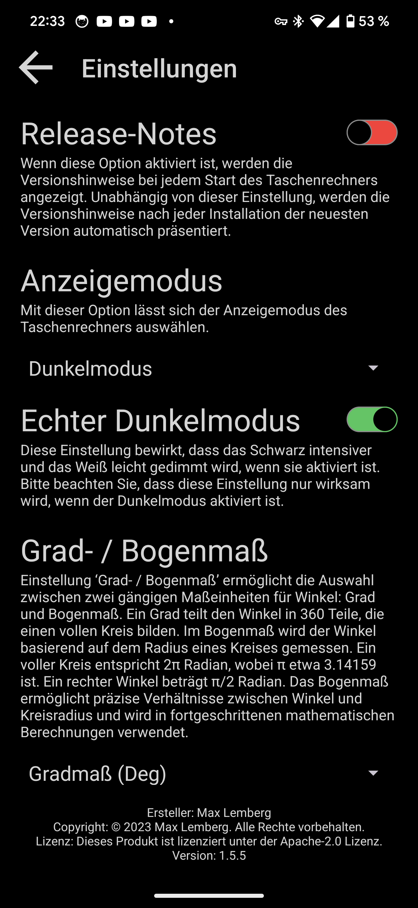

# Dokumentation - RechenMax (Taschenrechner)

## Übersicht

RechenMax ist eine leistungsstarke und benutzerfreundliche Taschenrechner-App, die eine Vielzahl von mathematischen Operationen unterstützt. Von grundlegenden Rechenoperationen bis hin zu komplexen wissenschaftlichen Berechnungen, RechenMax ist perfekt auf die Anforderungen einer breiten Palette von Anwendungen zugeschnitten.

### Funktionen

Der Taschenrechner bietet eine Vielzahl von Funktionen:

- **Grundlegende mathematische Operationen**: Führen Sie grundlegende Rechenoperationen wie Addition (+), Subtraktion (-), Multiplikation (×) und Division (÷) durch.
  - Beispiel: Um 2 und 3 zu addieren, geben Sie 2+3 ein.

- **Erweiterte mathematische Operationen**: Nutzen Sie erweiterte mathematische Funktionen wie Potenzierung (^), Quadratwurzel (√) und Fakultät (!).
  - Beispiel: Um 4 zu quadrieren, geben Sie 4^2 ein.
  - Beispiel: Um die Quadratwurzel von 16 zu finden, geben Sie √(16) ein.
  - Beispiel: Um die Fakultät von 5 zu berechnen, geben Sie 5! ein.

  
  
  
  

  

- **Wissenschaftlicher Modus**: Schalten Sie in den wissenschaftlichen Modus um, um zusätzliche Funktionen wie Sinus, Cosinus, Tangens oder Pi zu nutzen.

- **Manuelle Eingabe der Wissenschaftlichen Notationen**: Sie können wissenschaftliche Notationen auch manuell eingeben.
  - Beispiel: Um 6.022 x 10^23 einzugeben, geben Sie 6.022e23 ein.
  - Beispiel: Um 2.718 x 10^-5 einzugeben, geben Sie 2.718e-5 ein.

- **Benutzerfreundliches Design**: Mit seinem sauberen und intuitiven Design ist RechenMax einfach zu bedienen und bietet eine optimale Benutzererfahrung.

- **Wissenschaftliche Notationen**: RechenMax kann auch wissenschaftliche Notationen verarbeiten und automatisch in Dezimalnotationen umwandeln.
  - Beispiel: Der Taschenrechner zeigt auch Ergebnisse in wissenschaftlicher Notation an, wenn das Ergebnis sehr groß oder sehr klein ist.

  
  
  
  

### Verwendung

Laden Sie die RechenMax-App herunter und starten Sie sie, um Ihre mathematischen Berechnungen durchzuführen. Die Ergebnisse werden in Echtzeit angezeigt. Ob Sie einfache Alltagsrechnungen schnell erledigen oder komplexe wissenschaftliche Gleichungen lösen müssen, RechenMax ist hervorragend darauf ausgelegt, Ihre Anforderungen zu erfüllen.
